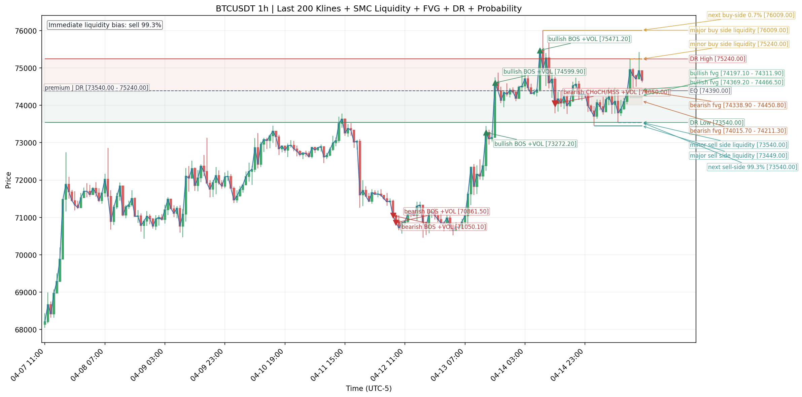

# SMC Analytics

SMC Analytics is a Python toolkit for analyzing cryptocurrency market data with Smart Money Concepts (SMC). It detects liquidity levels, Fair Value Gaps, market structure events, premium/discount zones, and a relative probability estimate for which nearby liquidity target may be taken next.

The project currently focuses on Binance Futures OHLCV data and includes both a live Binance API workflow and an optional MySQL-backed workflow for locally stored 5-minute klines.



## Features

- Detects buy-side and sell-side liquidity from swing highs and swing lows.
- Classifies liquidity as major or minor based on recent structure.
- Marks whether liquidity levels have already been swept.
- Detects bullish and bearish Fair Value Gaps (FVGs).
- Tracks whether FVGs have been filled.
- Detects market structure events such as BOS, CHoCH, and MSS.
- Adds optional volume confirmation metrics for structure breaks.
- Calculates the active dealing range and classifies price as premium, discount, or equilibrium.
- Estimates the relative probability of the next immediate buy-side or sell-side liquidity target.
- Prints terminal summaries and saves an annotated PNG chart.
- Supports Binance Futures API data or local MySQL kline data.

## Project Structure

```text
smc_analytics/
├── smc_liquidity.py              # Core SMC detection and scoring logic
├── smc_liquidity_monitor.py      # Binance Futures API command-line monitor
├── smc_liquidity_monitor_db.py   # Optional MySQL-backed command-line monitor
├── smc_liquidity_chart_BTCUSDT_1h.png
└── Readme.md
```

## How It Works

The core module, `smc_liquidity.py`, expects OHLCV candle data in a pandas DataFrame. It then builds separate tables for:

- Liquidity levels
- Fair Value Gaps
- Market structure events
- Dealing range and premium/discount context
- Immediate liquidity probability

The monitor scripts combine those tables into a practical report and generate an annotated chart with candles, liquidity levels, FVG zones, structure labels, dealing range overlays, and the highest-probability next liquidity target.

## Requirements

Use Python 3.8 or newer.

Install the required packages:

```bash
pip install numpy pandas requests matplotlib mysql-connector-python
```

If you only use the Binance API monitor, `mysql-connector-python` is not required.

## Quick Start

Clone the repository and enter the project folder:

```bash
git clone https://github.com/your-username/smc_analytics.git
cd smc_analytics
```

Create and activate a virtual environment:

```bash
python -m venv venv
source venv/bin/activate
```

Install dependencies:

```bash
pip install numpy pandas requests matplotlib
```

Run the Binance Futures monitor:

```bash
python smc_liquidity_monitor.py
```

By default, this analyzes `BTCUSDT` on the `1h` interval using the latest 300 Binance Futures candles.

## Binance API Usage

Analyze a different symbol or interval:

```bash
python smc_liquidity_monitor.py --symbol ETHUSDT --interval 15m --limit 500
```

Change swing sensitivity:

```bash
python smc_liquidity_monitor.py --swing-window 3 --major-window 8
```

Save the chart to a custom path:

```bash
python smc_liquidity_monitor.py --symbol BTCUSDT --interval 4h --chart-path charts/btc_4h_smc.png
```

Available CLI options:

```text
--symbol          Market symbol, for example BTCUSDT
--interval        Binance kline interval, for example 5m, 15m, 1h, 4h, 1d
--limit           Number of candles to analyze
--swing-window    Number of candles on each side used to confirm swings
--major-window    Recent swing window used to classify major/minor liquidity
--tolerance-pct   Tolerance used to count similar/equal liquidity levels
--rows            Number of summary rows to print
--chart-path      PNG output path
```

## MySQL Workflow

The optional `smc_liquidity_monitor_db.py` script reads candles from a MySQL table named `klines_5m`. It can analyze native 5-minute candles or resample them to larger intervals such as `15m` or `1h`.

Create a local `config.py` file in the same folder:

```python
DB_CONFIG = {
    "host": "localhost",
    "user": "your_user",
    "password": "your_password",
    "database": "your_database",
}
```

Expected table fields include:

```text
symbol, interval_, open_time, open, high, low, close, volume,
close_time, qav, trades, tbbav, tbqav, ignore, time
```

Run the database monitor:

```bash
python smc_liquidity_monitor_db.py --symbol BTCUSDT --interval 15m --limit 300
```

Save a chart from database data:

```bash
python smc_liquidity_monitor_db.py --symbol BTCUSDT --interval 1h --chart-path btc_db_1h.png
```

## Output

The scripts print sections like:

```text
Immediate Liquidity Probability
Dealing Range (Premium/Discount)
Market Structure
Liquidity Levels
Fair Value Gaps
```

They also save a PNG chart containing:

- Candlestick price action
- Buy-side and sell-side liquidity levels
- Fair Value Gap zones
- BOS, CHoCH, and MSS labels
- Premium, discount, and equilibrium range
- Next liquidity target probability annotation

If no chart path is provided, the default output name is:

```text
smc_liquidity_chart_<SYMBOL>_<INTERVAL>.png
```

## Core Module Example

You can also import the analysis functions directly:

```python
from smc_liquidity_monitor import get_klines
from smc_liquidity import (
    build_smc_liquidity_table,
    build_fvg_table,
    build_market_structure_table,
    build_dealing_range_table,
    build_immediate_liquidity_probability_table,
)

df = get_klines(symbol="BTCUSDT", interval="1h", limit=300)

liquidity = build_smc_liquidity_table(df)
fvg = build_fvg_table(df)
structure = build_market_structure_table(df)
dealing_range = build_dealing_range_table(df)
probability = build_immediate_liquidity_probability_table(
    df,
    liquidity_df=liquidity,
    structure_df=structure,
    fvg_df=fvg,
    dealing_range_df=dealing_range,
)

print(probability)
```

## Notes

- Binance timestamps are converted to a fixed UTC-5 display timezone.
- The probability table is a relative scoring model based on nearby liquidity, market structure, dealing range context, and FVG confluence. It is not a predictive guarantee.
- The MySQL workflow assumes 5-minute source candles and resamples them upward when needed.
- This project is for research and analytics only. It is not financial advice.

## License
Apache License 2.0
